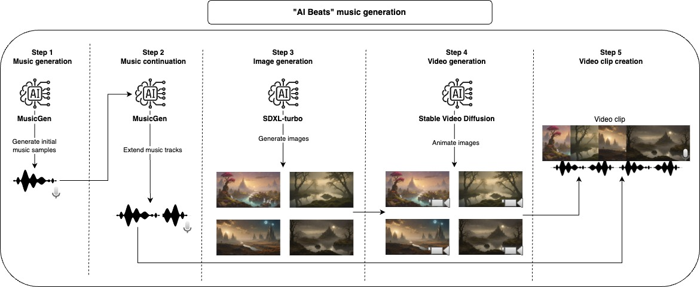

# AI beats



---

With this project, you can use AI to generate music tracks and video clips. Provide some information on how you would like the music and videos, the code will do the rest.

### Music generation workflow
First, we use a generative model to create music samples, the default model used here is only able to generate a max of 30 seconds of music, for this reason, we take another step to extend the music. After finishing with the audio part we can generate the video, first, we start with a Stable Diffusion model to generate images and then we use another generative model to give it a bit of motion and animation. To compose the final video clip, we take each generated music and join together with as many animated images as necessary to match the length of the music.

All of those steps will generate intermediate files that you can inspect and manually remove what you don't like to improve the results.

# Examples
### AI Beats Vol. 1
[](https://www.youtube.com/watch?v=l7kxwPnt5m0)

### AI Beats Vol. 2
[](https://www.youtube.com/watch?v=O9DgVkp9qto)

# Usage
The recommended approach to use this repository is with [Docker](https://docs.docker.com/), but you can also use a custom venv, just make sure to install all dependencies.

> Note: make sure to update the device param to maximize performance, but notice that some models might not work for all device options (cpu, cuda, mps).

## Application workflow
1. **Music generation:** Generate the initial music tracks
2. **Music continuation:** Extend the initial music tracks to a longer duration
3. **Image generation:** Create the images that will be used to fill the video clip
4. **Video generation:** Generate animations from the images to compose video clips
5. **Video clip creation:** Join multiple video clips together to accompany the music tracks

## Configs
```
project_dir: beats
project_name: lofi
seed: 42
music:
  prompt: "lo-fi music with a relaxing slow melody"
  model_id: facebook/musicgen-small
  device: cpu
  n_music: 5
  music_duration: 60
  initial_music_tokens: 1050
  max_continuation_duration: 20
  prompt_music_duration: 10
image:
  prompt: "Mystical Landscape"
  prompt_modifiers: 
    - "concept art, HQ, 4k"
    - "epic scene, cinematic, sci fi cinematic look, intense dramatic scene"
    - "digital art, hyperrealistic, fantasy, dark art"
    - "digital art, hyperrealistic, sense of comsmic wonder"
    - "mystical and ethereal atmosphere, photo taken with a wide-angle lens"
  model_id: stabilityai/sdxl-turbo
  device: mps
  n_images: 5
  inference_steps: 3
  height: 576
  width: 1024
video:
  model_id: stabilityai/stable-video-diffusion-img2vid
  device: cpu
  n_continuations: 2
  loop_video: true
  video_fps: 6
  decode_chunk_size: 8
  motion_bucket_id: 127
  noise_aug_strength: 0.1
audio_clip:
  n_music_loops: 1
```
- **project_dir**: Folder that will host all your projects
- **project_name**: Project name and main folder
- **seed**: Seed used to control the randomness of the models
- **music**
  - **prompt:** Text prompt used to generate the music
  - **model_id:** Model used to generate and extend the music tracks
  - **device**: Device used by the model, usually one of (cpu, cuda, mps)
  - **n_music:** Number of music tracks that will be created
  - **music_duration:** Duration length of the final music
  - **initial_music_tokens:** Duration length of the initial music (in tokens)
  - **max_continuation_duration:** Maximum length of each extended music segment
  - **prompt_music_duration:** Length of base music used to create the extension
- **image**
  - **prompt:** Text prompt used to generate the images
  - **prompt_modifiers:** Prompt modifiers used to change the image style
  - **model_id:** Model used to create the images
  - **device**: Device used by the model, usually one of (cpu, cuda, mps)
  - **n_images:** Number of images that will be created
  - **inference_steps:** Number of inference steps for the diffusion model
  - **height:** Height of the generated image
  - **width:** Width of the generated image
- **video**
  - **model_id:** Model used to animate the images
  - **device**: Device used by the model, usually one of (cpu, cuda, mps)
  - **n_continuations:** Number of animation segments that will be created
  - **loop_video:** If the each music video will be looped
  - **video_fps:** Frames per second of each video clip
  - **decode_chunk_size:** Video diffusion's decode chunk size parameter
  - **motion_bucket_id:** Video diffusion's motion bucket id parameter
  - **noise_aug_strength:** Video diffusion's noise aug strength parameter
- **audio_clip**
  - **n_music_loops:** Number of times to loop each music track

## Commands
Build the Docker image
```bash
make build
```

Apply lint and formatting to the code (only needed for development)
```bash
make lint
```

Run the whole pipeline to create the music video
```bash
make ai_beats
```

Run the music generation step
```bash
make music
```

Run the music continuation step
```bash
make music_continuation
```

Run the image generation step
```bash
make image
```

Run the video generation step
```bash
make video
```

Run the audio clip creation step
```bash
make audio_clip
```

# Development
For development make sure to install `requirements-dev.txt` and run `make lint` to maintain the coding style.

# Requirements
I developed and tested most of this project on my MacBook Pro M2, the only step that I was not able to run was the video creation step, for that I used Google Colab (with V100 or A100 GPU). Some of the models were not runnable on `MPS` but they run on a reasonable time anyway.

# Disclaimers
The models used by default here have specific licenses that might not be suited for all use cases, if you want to use the same models make sure to check their licenses. For music generation [MusicGen](https://huggingface.co/facebook/musicgen-small) and its [CC-BY-NC 4.0](https://github.com/facebookresearch/audiocraft/blob/main/LICENSE_weights) license, for image generation [SDXL-Turbo](https://huggingface.co/stabilityai/sdxl-turbo) and its [LICENSE-SDXL1.0](https://github.com/Stability-AI/generative-models/blob/main/model_licenses/LICENSE-SDXL1.0) license, and [stable video diffusion](https://huggingface.co/stabilityai/stable-video-diffusion-img2vid) and its [STABLE VIDEO DIFFUSION NC COMMUNITY LICENSE](https://huggingface.co/stabilityai/stable-video-diffusion-img2vid/blob/main/LICENSE) license for video generation.

# References
- [MusicGen](https://huggingface.co/facebook/musicgen-small)
- [SDXL-turbo](https://huggingface.co/stabilityai/sdxl-turbo)
- [Stable Video Diffusion](https://huggingface.co/stabilityai/stable-video-diffusion-img2vid)
- [Stable Video Diffusion - usage tips](https://huggingface.co/docs/diffusers/main/en/using-diffusers/svd)